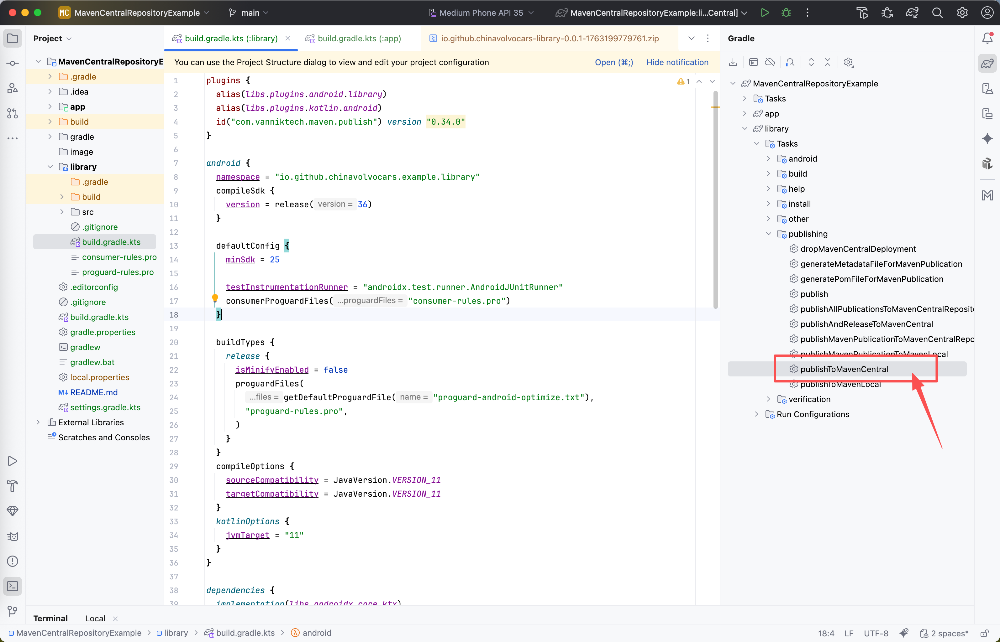

# MavenCentralRepositoryExample
upload android aar to Maven Central Repository


## 1.在项目build.gradle.kts添加下面信息
`id("com.vanniktech.maven.publish") version "0.34.0"`
```kotlin
// Top-level build file where you can add configuration options common to all sub-projects/modules.
plugins {
  alias(libs.plugins.android.application) apply false
  alias(libs.plugins.kotlin.android) apply false
  alias(libs.plugins.android.library) apply false

  id("com.vanniktech.maven.publish") version "0.34.0"
}
```

## 2.在gradle.properties添加下面信息

```properties
mavenCentralUsername=xxxxxxxx
mavenCentralPassword=xxxxxxxxx
signing.keyId=xxx
signing.password=xxx
signing.secretKeyRingFile=/xxx/yyyy/secring.gpg
```

>注意使用`base64 -i secring.gpg -o cert.base64 `命令生成 cert.base64文件，将文件中的信息复制到 github action的`GPG_KEY_CONTENTS`中

> 详情参考：[将你的库发布到 Maven Central – 教程](https://docs.kmpstudy.com/multiplatform-publish-libraries.html#z34aij9_12)

> 参考2： [Storing Base64 binary blobs as secrets](https://docs.github.com/en/actions/how-tos/write-workflows/choose-what-workflows-do/use-secrets#storing-base64-binary-blobs-as-secrets)

## 3.在library/build.gradle.kts添加下面信息
`id("com.vanniktech.maven.publish") version "0.34.0"`

```kotlin
group = "io.github.chinavolvocars"
version = "0.0.1"

mavenPublishing {
  publishToMavenCentral()
  signAllPublications()

  coordinates(group.toString(), "library", version.toString())

  pom {
    name = "library"
    description = "A library."
    inceptionYear = "2025"
    url = "https://github.com/ChinaVolvocars/library/"
    licenses {
      license {
        name = "The Apache License, Version 2.0"
        url = "https://www.apache.org/licenses/LICENSE-2.0.txt"
        distribution = "https://www.apache.org/licenses/LICENSE-2.0.txt"
      }
    }
    developers {
      developer {
        id = "atlantis"
        name = "Android Developer Atlantis"
        url = "https://github.com/ChinaVolvocars/"
      }
    }
    scm {
      url = "https://github.com/ChinaVolvocars/library/"
      connection = "scm:git:git://github.com/ChinaVolvocars/library.git"
      developerConnection = "scm:git:ssh://git@github.com/ChinaVolvocars/library.git"
    }
  }
}
```

### 完整如下图所示
```kotlin
plugins {
  alias(libs.plugins.android.library)
  alias(libs.plugins.kotlin.android)
  id("com.vanniktech.maven.publish") version "0.34.0"
}

android {
  namespace = "io.github.chinavolvocars.example.library"
  compileSdk {
    version = release(36)
  }

  defaultConfig {
    minSdk = 25

    testInstrumentationRunner = "androidx.test.runner.AndroidJUnitRunner"
    consumerProguardFiles("consumer-rules.pro")
  }

  buildTypes {
    release {
      isMinifyEnabled = false
      proguardFiles(
        getDefaultProguardFile("proguard-android-optimize.txt"),
        "proguard-rules.pro",
      )
    }
  }
  compileOptions {
    sourceCompatibility = JavaVersion.VERSION_11
    targetCompatibility = JavaVersion.VERSION_11
  }
  kotlinOptions {
    jvmTarget = "11"
  }
}

dependencies {
  implementation(libs.androidx.core.ktx)
  implementation(libs.androidx.appcompat)
  implementation(libs.material)
  testImplementation(libs.junit)
  androidTestImplementation(libs.androidx.junit)
  androidTestImplementation(libs.androidx.espresso.core)
}

group = "io.github.chinavolvocars"
version = "0.0.1"

mavenPublishing {
  publishToMavenCentral()
  signAllPublications()

  coordinates(group.toString(), "library", version.toString())

  pom {
    name = "library"
    description = "A library."
    inceptionYear = "2025"
    url = "https://github.com/ChinaVolvocars/library/"
    licenses {
      license {
        name = "The Apache License, Version 2.0"
        url = "https://www.apache.org/licenses/LICENSE-2.0.txt"
        distribution = "https://www.apache.org/licenses/LICENSE-2.0.txt"
      }
    }
    developers {
      developer {
        id = "atlantis"
        name = "Android Developer Atlantis"
        url = "https://github.com/ChinaVolvocars/"
      }
    }
    scm {
      url = "https://github.com/ChinaVolvocars/library/"
      connection = "scm:git:git://github.com/ChinaVolvocars/library.git"
      developerConnection = "scm:git:ssh://git@github.com/ChinaVolvocars/library.git"
    }
  }
}
```

## 4.点击publishToMavenCentral上传到Maven Central Repository仓库

